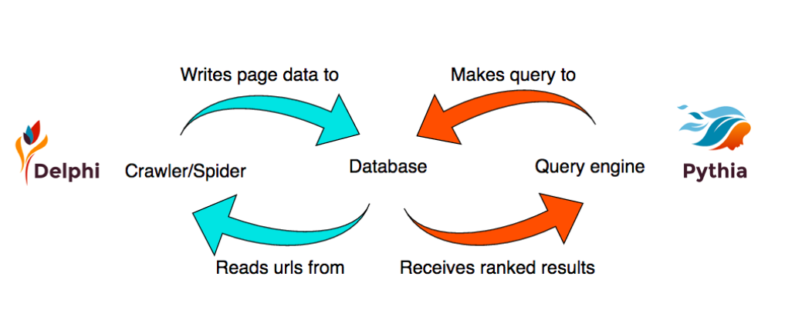

# Pythia & Delphi: Building a search engine

## A Makers Academy final project

### Team
- [Andy Bell](https://github.com/Andy-Bell)
- [Daniel Chambers](https://github.com/danielschambers)
- [Sophie Rimington-Pounder](https://github.com/srp2930)
- [Merve Taner](https://github.com/mtaner)

### About the project

Pythia & Delphi form the two main parts of our search engine, the web crawler and the query engine. Both programmes are built using Elixir, a functional programming language, for the following reasons:

 - Friendly syntax, great documentation and community support
 - Faster than Ruby or Python
 - As it is built on Erlang, it is easy to spawn new processes to create multi-threaded process systems

As well as Elixir, we also used:
 -  ESpec and Hound to test the code
 -  Phoenix Framework to build the query engine
 -  Ecto and Postgres to store the urls and the collected information



- Video to project presentation (coming soon)
- [Link to project presentation](https://docs.google.com/presentation/d/10LDF3dIhCKR54XAlErlkmO9t6Vwak3I8doAshWGfozQ/edit#slide=id.g158daf373d_0_41)

#### Delphi

##### How to set up
```
$ clone the repo locally (https://github.com/Andy-Bell/delphi)
$ cd delphi
$ mix deps.get
$ mix ecto.create && mix ecto.migrate
```

Delphi includes 3 main parts:
- Url Writer
- Url Scraper
- Spider

<b>Url Writer</b> takes one url (string) as an argument, and writes the urls on that page to the database.

```
$ iex -S mix
$ UrlWriter.add_url_to_table("http://www.makersacademy.com")
```
The database has an unique-url constraint. If an url that has already been added to the url database is trying to be added again by the UrlWriter, it will return an error message, and will move on to the next url.

<b>Url Scraper</b>, similar to the Url Writer, takes one url (string) as an argument and will collect the title and the description on that page. This will then get added to a second database which stores the data.

```
$ iex -S mix
$ UrlScraper.search_urls("http://www.makersacademy.com")
```

<b>Web Crawler/Spider</b> goes through the url database, and it will scrape the information from those links, and will add the url and the scraped information to the respective databases. It will then follow the urls on the pages it accessed and continue collecting information from every page it visits. As mentioned above, Elixir made it quite fast and easy to spawn hundreds of spiders going through different urls and collecting information.


#### Pythia

##### How to set up

```
$ clone this repo locally
$ cd pythia
$ mix deps.get
$ npm install

```
#### How to run
```
$ mix server.start
Visit http://localhost:4000 from your browser.
```
We used the Phoenix Framework to build Pythia. It is very similar to Ruby on Rails Framework but provides more flexibility around customisation.

Pythia handles the user queries, and returning relevant results to the user. It will list the results based on the following:

- Accessing the database which stores the scraped information from the urls, and return all the relevant links and information stored.
- Ranking the results based on a simple algorithm which involves checking whether the keyword is included in the url, title and/or the description.


#### Next steps:
Improving spider efficiency and limitation
, and the search algorithm
